# Documentación Técnica — Gorditas Doña Félix

Sistema POS + ERP para una taquería/gorditas. Construido sobre **Next.js 16 App Router**, **Supabase** (Postgres + Auth + Realtime) y desplegado en **Vercel free tier** (serverless, sin procesos long-running).

---

## Tabla de contenidos

1. [Arquitectura general](#1-arquitectura-general)
2. [Esquema de base de datos](#2-esquema-de-base-de-datos)
3. [Autenticación y control de acceso](#3-autenticación-y-control-de-acceso)
4. [API Endpoints](#4-api-endpoints)
5. [Arquitectura de frontend](#5-arquitectura-de-frontend)
6. [Sistema de Agente IA](#6-sistema-de-agente-ia)
7. [Flujos operativos clave](#7-flujos-operativos-clave)
8. [PWA e infraestructura web](#8-pwa-e-infraestructura-web)

---

## 1. Arquitectura general

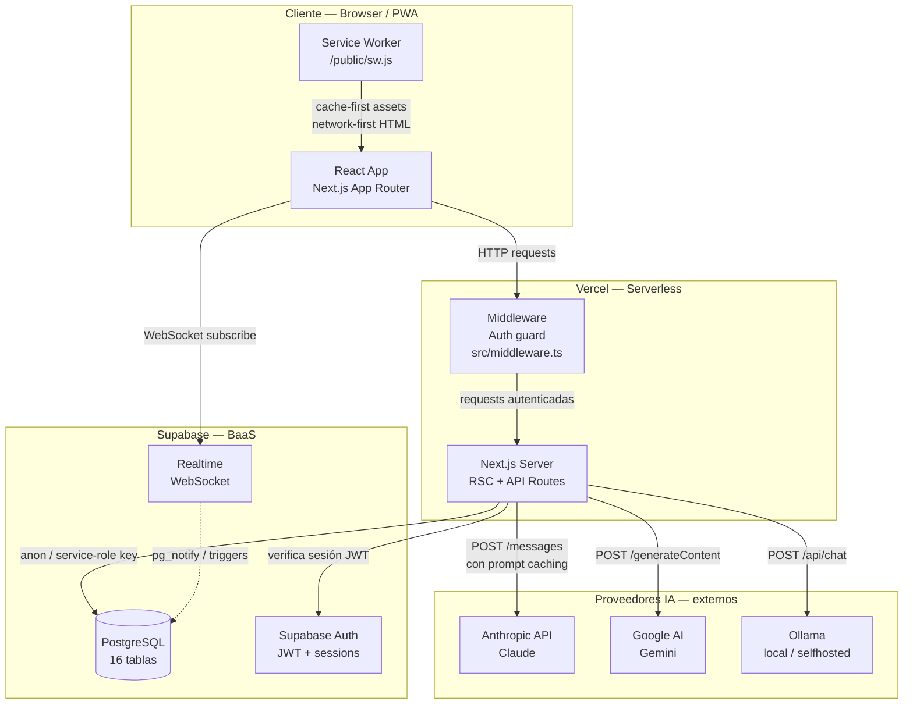
```mermaid
graph TD
    subgraph Browser["Cliente — Browser / PWA"]
        FE["React App<br/>Next.js App Router"]
        SW["Service Worker<br/>/public/sw.js"]
    end

    subgraph Vercel["Vercel — Serverless"]
        MW["Middleware<br/>Auth guard<br/>src/middleware.ts"]
        SERVER["Next.js Server<br/>RSC + API Routes"]
    end

    subgraph Supabase["Supabase — BaaS"]
        DB[("PostgreSQL<br/>16 tablas")]
        AUTH["Supabase Auth<br/>JWT + sessions"]
        RT["Realtime<br/>WebSocket"]
    end

    subgraph AIProviders["Proveedores IA — externos"]
        CLAUDE["Anthropic API<br/>Claude"]
        GEMINI["Google AI<br/>Gemini"]
        OLLAMA["Ollama<br/>local / selfhosted"]
    end

    FE -->|"HTTP requests"| MW
    MW -->|"requests autenticadas"| SERVER
    SERVER -->|"anon / service-role key"| DB
    SERVER -->|"verifica sesión JWT"| AUTH
    SERVER -->|"POST /messages<br/>con prompt caching"| CLAUDE
    SERVER -->|"POST /generateContent"| GEMINI
    SERVER -->|"POST /api/chat"| OLLAMA
    FE -->|"WebSocket subscribe"| RT
    RT -.->|"pg_notify / triggers"| DB
    SW -->|"cache-first assets<br/>network-first HTML"| FE
```

> **Restricción de plataforma:** Vercel free tier no permite procesos long-running. Todo es serverless functions con timeout máximo de ~10 s. El agente IA ejecuta tool calls de forma sincrónica dentro de ese límite.

---

## 2. Esquema de base de datos

### 2.1 Tablas principales — operación del restaurante

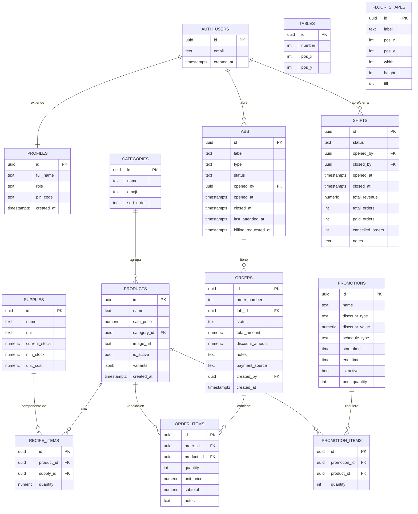
```mermaid
erDiagram
    AUTH_USERS {
        uuid id PK
        text email
        timestamptz created_at
    }
    PROFILES {
        uuid id PK
        text full_name
        text role
        text pin_code
        timestamptz created_at
    }
    CATEGORIES {
        uuid id PK
        text name
        text emoji
        int sort_order
    }
    PRODUCTS {
        uuid id PK
        text name
        numeric sale_price
        uuid category_id FK
        text image_url
        bool is_active
        jsonb variants
        timestamptz created_at
    }
    SUPPLIES {
        uuid id PK
        text name
        text unit
        numeric current_stock
        numeric min_stock
        numeric unit_cost
    }
    RECIPE_ITEMS {
        uuid id PK
        uuid product_id FK
        uuid supply_id FK
        numeric quantity
    }
    TABLES {
        uuid id PK
        int number
        int pos_x
        int pos_y
    }
    FLOOR_SHAPES {
        uuid id PK
        text label
        int pos_x
        int pos_y
        int width
        int height
        text fill
    }
    TABS {
        uuid id PK
        text label
        text type
        text status
        uuid opened_by FK
        timestamptz opened_at
        timestamptz closed_at
        timestamptz last_attended_at
        timestamptz billing_requested_at
    }
    ORDERS {
        uuid id PK
        int order_number
        uuid tab_id FK
        text status
        numeric total_amount
        numeric discount_amount
        text notes
        text payment_source
        uuid created_by FK
        timestamptz created_at
    }
    ORDER_ITEMS {
        uuid id PK
        uuid order_id FK
        uuid product_id FK
        int quantity
        numeric unit_price
        numeric subtotal
        text notes
    }
    SHIFTS {
        uuid id PK
        text status
        uuid opened_by FK
        uuid closed_by FK
        timestamptz opened_at
        timestamptz closed_at
        numeric total_revenue
        int total_orders
        int paid_orders
        int cancelled_orders
        text notes
    }
    PROMOTIONS {
        uuid id PK
        text name
        text discount_type
        numeric discount_value
        text schedule_type
        time start_time
        time end_time
        bool is_active
        int pool_quantity
    }
    PROMOTION_ITEMS {
        uuid id PK
        uuid promotion_id FK
        uuid product_id FK
        int quantity
    }

    AUTH_USERS ||--|| PROFILES : "extiende"
    AUTH_USERS ||--o{ TABS : "abre"
    AUTH_USERS ||--o{ SHIFTS : "abre/cierra"
    CATEGORIES ||--o{ PRODUCTS : "agrupa"
    PRODUCTS ||--o{ RECIPE_ITEMS : "usa"
    SUPPLIES ||--o{ RECIPE_ITEMS : "componente de"
    TABS ||--o{ ORDERS : "tiene"
    ORDERS ||--o{ ORDER_ITEMS : "contiene"
    PRODUCTS ||--o{ ORDER_ITEMS : "vendido en"
    PROMOTIONS ||--o{ PROMOTION_ITEMS : "requiere"
    PRODUCTS ||--o{ PROMOTION_ITEMS : "incluido en"
```

### 2.2 Tablas de IA y configuración

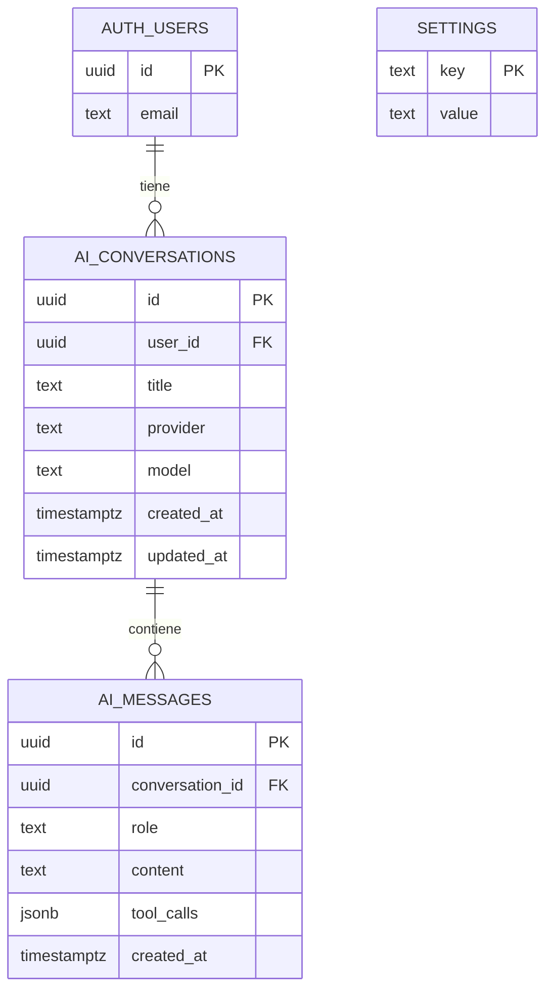
```mermaid
erDiagram
    AUTH_USERS {
        uuid id PK
        text email
    }
    AI_CONVERSATIONS {
        uuid id PK
        uuid user_id FK
        text title
        text provider
        text model
        timestamptz created_at
        timestamptz updated_at
    }
    AI_MESSAGES {
        uuid id PK
        uuid conversation_id FK
        text role
        text content
        jsonb tool_calls
        timestamptz created_at
    }
    SETTINGS {
        text key PK
        text value
    }

    AUTH_USERS ||--o{ AI_CONVERSATIONS : "tiene"
    AI_CONVERSATIONS ||--o{ AI_MESSAGES : "contiene"
```

### 2.3 Claves de configuración en `settings`

| Clave | Propósito |
|---|---|
| `ai_provider` | Proveedor activo: `claude` / `gemini` / `ollama` |
| `ai_model` | ID del modelo configurado |
| `ai_claude_key` | API key de Anthropic (encriptada en transit) |
| `ai_gemini_key` | API key de Google AI |
| `ai_ollama_url` | URL base del servidor Ollama |
| `ai_business_context` | Contexto generado en el entrenamiento (lenguaje natural) |
| `ai_business_name` | Nombre del restaurante |
| `ai_business_type` | Tipo de negocio |
| `ai_business_description` | Descripción libre |
| `ai_last_trained_at` | Timestamp ISO del último entrenamiento |
| `theme` | Tema de color UI: `amber` / `emerald` / `blue` / `violet` / `rose` / `slate` |

### 2.4 Enumeraciones importantes

| Campo | Valores válidos |
|---|---|
| `profiles.role` | `admin` `waiter` `kitchen` `cashier` |
| `tabs.type` | `table` `client` |
| `tabs.status` | `open` `closed` |
| `orders.status` | `pending` `preparing` `ready` `paid` `cancelled` |
| `orders.payment_source` | `pos` `caja` `agent` |
| `shifts.status` | `open` `closed` |
| `supplies.unit` | `gr` `ml` `pza` |
| `promotions.discount_type` | `fixed` `percent` |
| `promotions.schedule_type` | `all_day` `window` |

---

## 3. Autenticación y control de acceso

### 3.1 Flujo de autenticación (middleware)

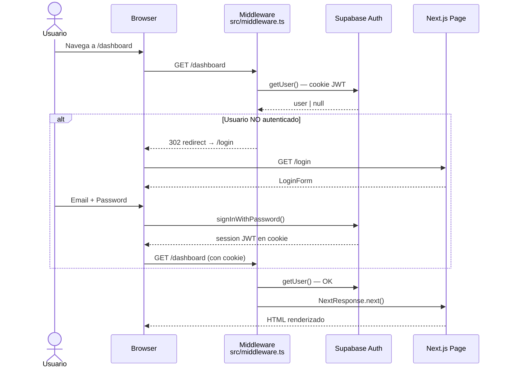
```mermaid
sequenceDiagram
    actor Usuario
    participant Browser
    participant Middleware as Middleware<br/>src/middleware.ts
    participant SupabaseAuth as Supabase Auth
    participant Page as Next.js Page

    Usuario->>Browser: Navega a /dashboard
    Browser->>Middleware: GET /dashboard
    Middleware->>SupabaseAuth: getUser() — cookie JWT
    SupabaseAuth-->>Middleware: user | null

    alt Usuario NO autenticado
        Middleware-->>Browser: 302 redirect → /login
        Browser->>Page: GET /login
        Page-->>Browser: LoginForm
        Usuario->>Browser: Email + Password
        Browser->>SupabaseAuth: signInWithPassword()
        SupabaseAuth-->>Browser: session JWT en cookie
        Browser->>Middleware: GET /dashboard (con cookie)
    end

    Middleware->>SupabaseAuth: getUser() — OK
    Middleware->>Page: NextResponse.next()
    Page-->>Browser: HTML renderizado
```

**Rutas excluidas del middleware** (nunca interceptadas):
`_next/static` · `_next/image` · `favicon.ico` · `sw.js` · `manifest.webmanifest` · `offline.html` · `icon-*.png` · `*.svg|png|jpg|jpeg|gif|webp`

### 3.2 Matriz de acceso por rol

| Ruta | admin | waiter | kitchen | cashier |
|------|:-----:|:------:|:-------:|:-------:|
| `/dashboard` `/products` `/categories` `/inventory` `/recipes` `/reports` `/orders` `/promotions` `/users` `/settings` `/corte` `/assistant` | ✓ | — | — | — |
| `/caja` | ✓ | — | — | ✓ |
| `/floor` | ✓ | ✓ | ✓ | ✓ |
| `/pos` | ✓ | ✓ | — | — |
| `/kitchen` | ✓ | ✓ | ✓ | ✓ |

### 3.3 Clientes Supabase — cuándo se usa cada uno

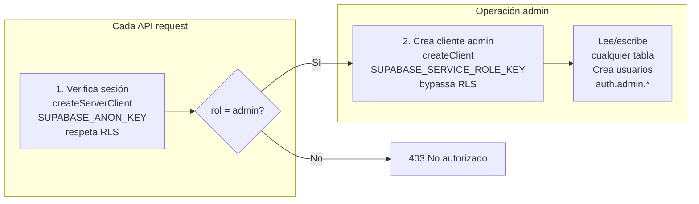
```mermaid
graph LR
    subgraph Request["Cada API request"]
        A["1. Verifica sesión<br/>createServerClient<br/>SUPABASE_ANON_KEY<br/>respeta RLS"]
        B{"rol = admin?"}
        A --> B
    end

    subgraph AdminOp["Operación admin"]
        C["2. Crea cliente admin<br/>createClient<br/>SUPABASE_SERVICE_ROLE_KEY<br/>bypassa RLS"]
        D["Lee/escribe<br/>cualquier tabla<br/>Crea usuarios<br/>auth.admin.*"]
        C --> D
    end

    B -->|"Sí"| C
    B -->|"No"| E["403 No autorizado"]
```

---

## 4. API Endpoints

### 4.1 Resumen de endpoints

| Método | Ruta | Auth | Descripción |
|--------|------|------|-------------|
| `POST` | `/api/ai/chat` | admin | Envía mensaje al agente IA |
| `GET` | `/api/ai/conversations` | admin | Lista conversaciones (últimas 50) |
| `DELETE` | `/api/ai/conversations` | admin | Elimina una conversación |
| `GET` | `/api/ai/conversations/[id]` | admin | Carga mensajes de una conversación |
| `GET` | `/api/ai/settings` | admin | Lee configuración del agente |
| `POST` | `/api/ai/settings` | admin | Actualiza configuración del agente |
| `POST` | `/api/ai/initialize` | admin | Genera contexto de negocio (entrenamiento) |
| `GET` | `/api/users` | admin | Lista todos los usuarios |
| `POST` | `/api/users` | admin | Crea usuario en Auth + profiles |
| `PATCH` | `/api/users` | admin | Actualiza nombre, rol o contraseña |
| `DELETE` | `/api/users` | admin | Elimina usuario de Auth |

### 4.2 Detalle de endpoints — Agente IA

```mermaid
graph TD
    subgraph CHAT["POST /api/ai/chat"]
        C1["Body: message, conversationId?"]
        C2["Crea conversación si no existe<br/>title = primeros 60 chars del mensaje"]
        C3["Carga historial completo<br/>SELECT ai_messages ORDER BY created_at"]
        C4["Guarda mensaje usuario"]
        C5["Ejecuta agente con tools<br/>provider.run()"]
        C6["Guarda respuesta asistente<br/>con tool_calls jsonb"]
        C7["Response: reply, toolCalls, conversationId"]
        C8{"Error HTTP"}
        C9["401/API key → mensaje amigable<br/>404/modelo → mensaje amigable<br/>429/quota → mensaje amigable<br/>network → mensaje amigable"]
        C1-->C2-->C3-->C4-->C5-->C6-->C7
        C5-->C8-->C9
    end

    subgraph INIT["POST /api/ai/initialize"]
        I1["Sin body"]
        I2["Fetch paralelo:<br/>categories, products, tables,<br/>shifts, profiles, promotions, supplies"]
        I3["Construye contexto en lenguaje natural:<br/>nombre negocio, equipo, menú completo<br/>por categoría con precios, promociones,<br/>alertas de stock bajo"]
        I4["Upsert settings:<br/>ai_business_context<br/>ai_last_trained_at"]
        I5["Response: context"]
        I1-->I2-->I3-->I4-->I5
    end

    subgraph AISET["GET /POST /api/ai/settings"]
        S1["GET → devuelve provider, model,<br/>ollamaUrl, hasClaudeKey boolean,<br/>hasGeminiKey boolean,<br/>businessName, businessType,<br/>businessDescription, businessContext,<br/>lastTrainedAt"]
        S2["POST → upsert clave por clave<br/>en tabla settings<br/>Las API keys se guardan pero<br/>GET nunca las devuelve en texto"]
    end
```

### 4.3 Detalle de endpoints — Usuarios

```mermaid
graph TD
    subgraph GET_U["GET /api/users"]
        G1["auth.admin.listUsers<br/>perPage: 200"]
        G2["SELECT profiles.*"]
        G3["Join en memoria por UUID"]
        G4["Response: users con id, email,<br/>created_at, last_sign_in_at, profile"]
        G1-->G2-->G3-->G4
    end

    subgraph POST_U["POST /api/users"]
        P1["Body: email, password,<br/>full_name, userRole"]
        P2["auth.admin.createUser<br/>email_confirm: true"]
        P3["upsert profiles<br/>id, full_name, role"]
        P4["Response: user 201"]
        P1-->P2-->P3-->P4
    end

    subgraph PATCH_U["PATCH /api/users"]
        PA1["Body: userId, full_name?,<br/>userRole?, password?"]
        PA2{"password\npresente?"}
        PA3["auth.admin.updateUserById<br/>mínimo 6 chars"]
        PA4["UPDATE profiles<br/>full_name, role"]
        PA5["Response: ok: true"]
        PA1-->PA2
        PA2-->|"Sí"| PA3-->PA4-->PA5
        PA2-->|"No"| PA4
    end

    subgraph DEL_U["DELETE /api/users"]
        D1["Body: userId"]
        D2["auth.admin.deleteUser<br/>cascade en profiles por FK"]
        D3["Response: ok: true"]
        D1-->D2-->D3
    end
```

---

## 5. Arquitectura de frontend

### 5.1 Jerarquía de layouts — App Router

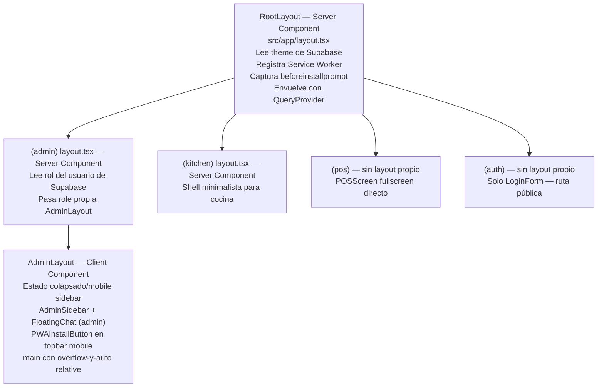
```mermaid
graph TD
    ROOT["RootLayout — Server Component<br/>src/app/layout.tsx<br/>Lee theme de Supabase<br/>Registra Service Worker<br/>Captura beforeinstallprompt<br/>Envuelve con QueryProvider"]

    ADMIN_L["(admin) layout.tsx — Server Component<br/>Lee rol del usuario de Supabase<br/>Pasa role prop a AdminLayout"]

    ADMIN_CL["AdminLayout — Client Component<br/>Estado colapsado/mobile sidebar<br/>AdminSidebar + FloatingChat (admin)<br/>PWAInstallButton en topbar mobile<br/>main con overflow-y-auto relative"]

    KITCHEN_L["(kitchen) layout.tsx — Server Component<br/>Shell minimalista para cocina"]

    POS_L["(pos) — sin layout propio<br/>POSScreen fullscreen directo"]

    AUTH_L["(auth) — sin layout propio<br/>Solo LoginForm — ruta pública"]

    ROOT --> ADMIN_L
    ROOT --> KITCHEN_L
    ROOT --> POS_L
    ROOT --> AUTH_L
    ADMIN_L --> ADMIN_CL
```

### 5.2 Árbol de componentes por módulo

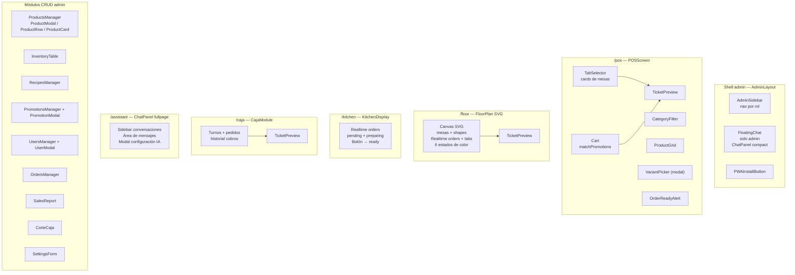
```mermaid
graph TD
    subgraph SHELL["Shell admin — AdminLayout"]
        SIDEBAR["AdminSidebar<br/>nav por rol"]
        FCHAT["FloatingChat<br/>solo admin<br/>ChatPanel compact"]
        PWABTN["PWAInstallButton"]
    end

    subgraph POS_MOD["/pos — POSScreen"]
        TS["TabSelector<br/>cards de mesas"]
        CF["CategoryFilter"]
        PG["ProductGrid"]
        VP["VariantPicker (modal)"]
        CART["Cart<br/>matchPromotions"]
        ORA["OrderReadyAlert"]
        TP1["TicketPreview"]
        TS --> TP1
        CART --> TP1
    end

    subgraph FLOOR_MOD["/floor — FloorPlan SVG"]
        FP["Canvas SVG<br/>mesas + shapes<br/>Realtime orders + tabs<br/>6 estados de color"]
        TP2["TicketPreview"]
        FP --> TP2
    end

    subgraph KITCHEN_MOD["/kitchen — KitchenDisplay"]
        KD["Realtime orders<br/>pending + preparing<br/>Botón → ready"]
    end

    subgraph CAJA_MOD["/caja — CajaModule"]
        CM["Turnos + pedidos<br/>historial cobros"]
        TP3["TicketPreview"]
        CM --> TP3
    end

    subgraph ASSISTANT_MOD["/assistant — ChatPanel fullpage"]
        CP["Sidebar conversaciones<br/>Área de mensajes<br/>Modal configuración IA"]
    end

    subgraph CRUD_MOD["Módulos CRUD admin"]
        PM["ProductsManager<br/>ProductModal / ProductRow / ProductCard"]
        IM["InventoryTable"]
        RM["RecipesManager"]
        PROM["PromotionsManager + PromotionModal"]
        UM["UsersManager + UserModal"]
        OM["OrdersManager"]
        SR["SalesReport"]
        CC["CorteCaja"]
        SF["SettingsForm"]
    end
```

### 5.3 Patrón Server Component → Client Component con Realtime

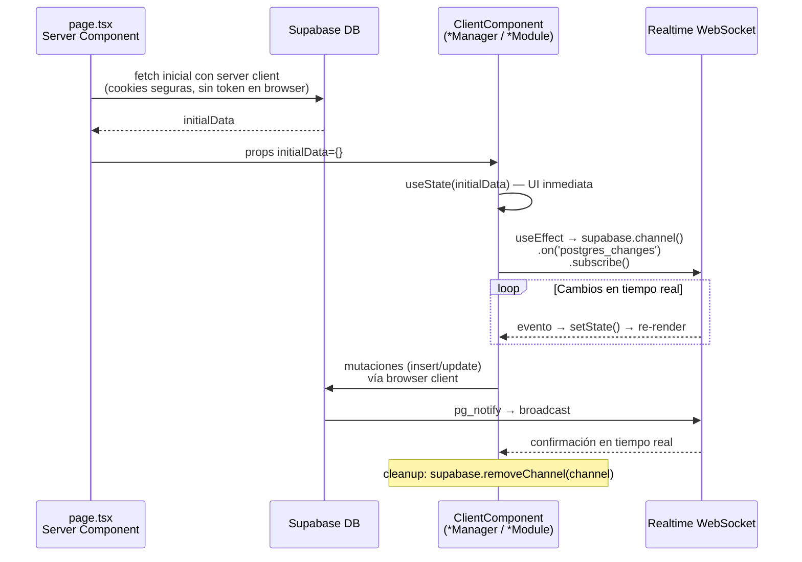
```mermaid
sequenceDiagram
    participant SC as page.tsx<br/>Server Component
    participant DB as Supabase DB
    participant CC as ClientComponent<br/>(*Manager / *Module)
    participant RT as Realtime WebSocket

    SC->>DB: fetch inicial con server client<br/>(cookies seguras, sin token en browser)
    DB-->>SC: initialData
    SC->>CC: props initialData={}

    CC->>CC: useState(initialData) — UI inmediata

    CC->>RT: useEffect → supabase.channel()<br/>.on('postgres_changes')<br/>.subscribe()

    loop Cambios en tiempo real
        RT-->>CC: evento → setState() → re-render
    end

    CC->>DB: mutaciones (insert/update)<br/>vía browser client
    DB->>RT: pg_notify → broadcast
    RT-->>CC: confirmación en tiempo real

    Note over CC: cleanup: supabase.removeChannel(channel)
```

**Regla importante:** todas las `page.tsx` bajo `(admin)/` tienen `export const dynamic = 'force-dynamic'` para garantizar datos frescos en cada request.

### 5.4 Tabla de datos iniciales por página

| Ruta | Fetch en Server Component | Client Component |
|------|--------------------------|-----------------|
| `/dashboard` | métricas turno activo | `DashboardClient` |
| `/products` | products + categories | `ProductsManager` |
| `/categories` | categories | `CategoryManagerClient` |
| `/inventory` | supplies | `InventoryTable` |
| `/recipes` | products + supplies + recipe_items | `RecipesManager` |
| `/reports` | orders del día (paid) | `SalesReport` |
| `/orders` | orders recientes | `OrdersManager` |
| `/promotions` | promotions + products | `PromotionsManager` |
| `/users` | — (todo vía API REST) | `UsersManager` |
| `/settings` | settings (AI + negocio) | `SettingsForm` |
| `/corte` | shifts | `CorteCaja` |
| `/floor` | tables + tabs + orders + shapes | `FloorPlan` |
| `/assistant` | — | `ChatPanel` (fullpage) |
| `/pos` | promotions | `POSScreen` |
| `/kitchen` | orders pending/preparing | `KitchenDisplay` |
| `/caja` | shifts + orders del turno | `CajaModule` |

### 5.5 FloorPlan — Máquina de estados de mesa

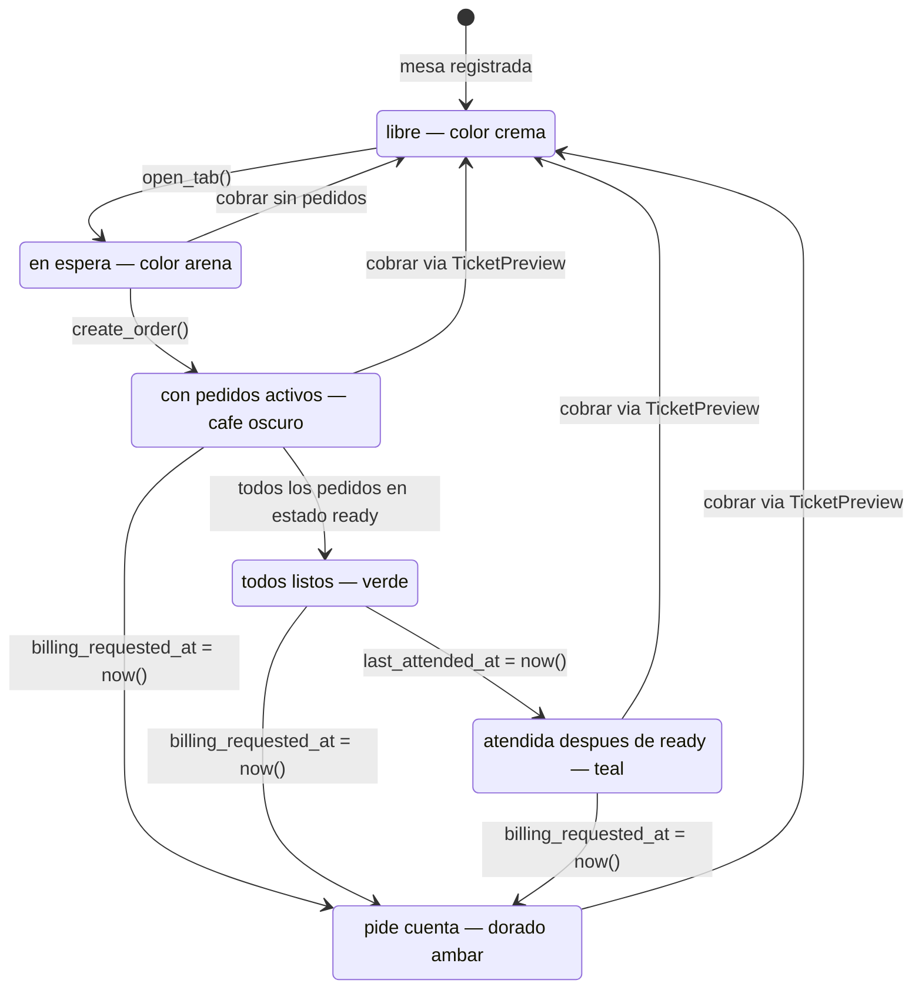
```mermaid
stateDiagram-v2
    [*] --> free : mesa registrada

    free --> waiting : open_tab()
    waiting --> active : create_order()
    active --> ready : todos los pedidos en estado ready
    active --> account : billing_requested_at = now()
    ready --> account : billing_requested_at = now()
    ready --> served : last_attended_at = now()
    served --> account : billing_requested_at = now()
    account --> free : cobrar via TicketPreview
    served --> free : cobrar via TicketPreview
    active --> free : cobrar via TicketPreview
    waiting --> free : cobrar sin pedidos

    free : libre — color crema
    waiting : en espera — color arena
    active : con pedidos activos — cafe oscuro
    ready : todos listos — verde
    served : atendida despues de ready — teal
    account : pide cuenta — dorado ambar
```

### 5.6 Convenciones de diseño UI

| Elemento | Clase Tailwind / regla |
|---|---|
| Sidebar background | `bg-brand-900` |
| Sidebar texto | `text-brand-100` / `text-brand-200` |
| Botón primario | `bg-brand-700 hover:bg-brand-600 text-white` |
| Botón destructivo | `text-red-600 border-red-200 hover:bg-red-50` |
| Fondo app | `bg-stone-100` |
| Modales | `flex flex-col max-h-[90vh] overflow-y-auto` |
| Página fullscreen (`/assistant`) | `absolute inset-0` — evita bug `h-full` en WebKit |
| FloatingChat < 1024px | Fullscreen panel |
| FloatingChat ≥ 1024px | Popup 384×520px anclado abajo-derecha |
| Sidebar < 1024px | Drawer con overlay (`mobileOpen` state) |
| Sidebar ≥ 1024px | Sidebar fija colapsable (`collapsed` state) |
| Iconos | Solo **Lucide React**, sin otras librerías |

---

## 6. Sistema de Agente IA

### 6.1 Arquitectura del agente

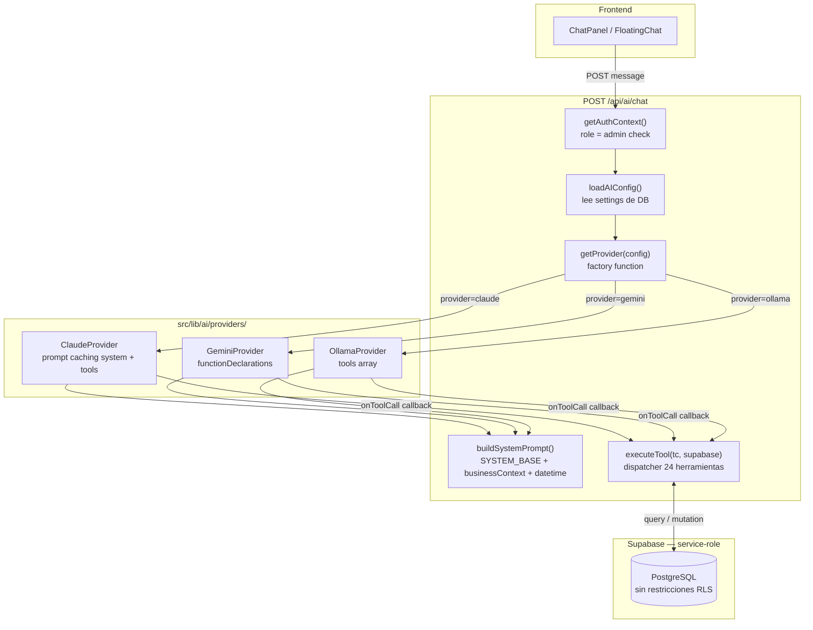
```mermaid
graph TD
    subgraph Frontend
        UI["ChatPanel / FloatingChat"]
    end

    subgraph APIRoute["POST /api/ai/chat"]
        AUTH_C["getAuthContext()<br/>role = admin check"]
        CFG["loadAIConfig()<br/>lee settings de DB"]
        FAC["getProvider(config)<br/>factory function"]
        PROMPT["buildSystemPrompt()<br/>SYSTEM_BASE + businessContext + datetime"]
        EXEC["executeTool(tc, supabase)<br/>dispatcher 24 herramientas"]
    end

    subgraph Providers["src/lib/ai/providers/"]
        CL["ClaudeProvider<br/>prompt caching system + tools"]
        GE["GeminiProvider<br/>functionDeclarations"]
        OL["OllamaProvider<br/>tools array"]
    end

    subgraph DBLayer["Supabase — service-role"]
        PG[("PostgreSQL<br/>sin restricciones RLS")]
    end

    UI -->|"POST message"| AUTH_C
    AUTH_C --> CFG
    CFG --> FAC
    FAC -->|"provider=claude"| CL
    FAC -->|"provider=gemini"| GE
    FAC -->|"provider=ollama"| OL
    CL & GE & OL --> PROMPT
    CL -->|"onToolCall callback"| EXEC
    GE -->|"onToolCall callback"| EXEC
    OL -->|"onToolCall callback"| EXEC
    EXEC <-->|"query / mutation"| PG
```

### 6.2 System prompt — dos capas

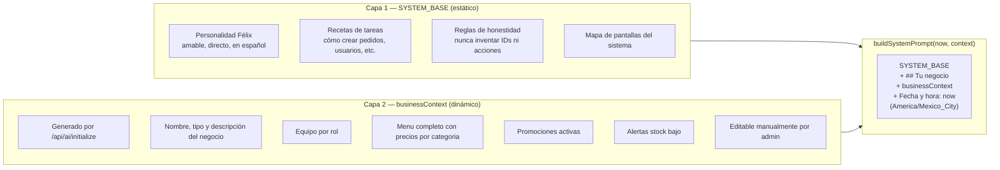
```mermaid
graph LR
    subgraph L1["Capa 1 — SYSTEM_BASE (estático)"]
        S1["Personalidad Félix<br/>amable, directo, en español"]
        S2["Recetas de tareas<br/>cómo crear pedidos, usuarios, etc."]
        S3["Reglas de honestidad<br/>nunca inventar IDs ni acciones"]
        S4["Mapa de pantallas del sistema"]
    end

    subgraph L2["Capa 2 — businessContext (dinámico)"]
        B1["Generado por /api/ai/initialize"]
        B2["Nombre, tipo y descripción del negocio"]
        B3["Equipo por rol"]
        B4["Menu completo con precios por categoria"]
        B5["Promociones activas"]
        B6["Alertas stock bajo"]
        B7["Editable manualmente por admin"]
    end

    subgraph OUT["buildSystemPrompt(now, context)"]
        R["SYSTEM_BASE<br/>+ ## Tu negocio<br/>+ businessContext<br/>+ Fecha y hora: now<br/>(America/Mexico_City)"]
    end

    L1 --> OUT
    L2 --> OUT
```

### 6.3 Comparativa de proveedores

| Proveedor | Modelo default | Prompt caching | Function calling | Notas |
|---|---|:---:|---|---|
| **Claude** | `claude-haiku-4-5-20251001` | ✓ system + last tool | `tools[]` nativo | Requiere API key. Mejor calidad |
| **Gemini** | `gemini-2.0-flash-lite` | — | `functionDeclarations[]` | Requiere API key. Free tier. Evitar `gemini-2.0-flash` (cuota baja) |
| **Ollama** | `llama3.1` | — | `tools[]` | Sin API key. Local/selfhosted. Solo modelos con function calling real (llama3.1+). NO usar qwen2.5 ni modelos pequeños |

### 6.4 Flujo completo de una conversación con tool calls

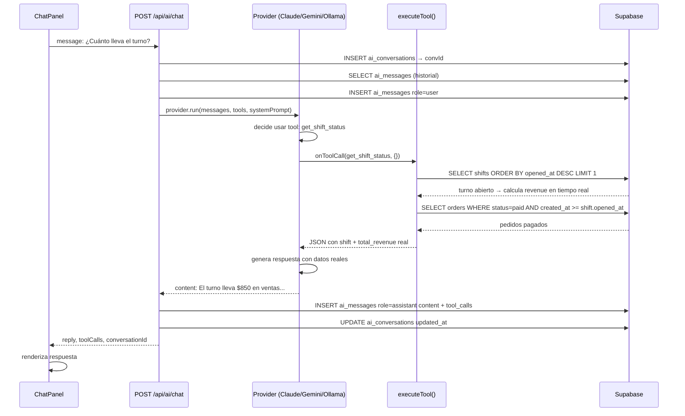
```mermaid
sequenceDiagram
    participant UI as ChatPanel
    participant API as POST /api/ai/chat
    participant LLM as Provider (Claude/Gemini/Ollama)
    participant EXEC as executeTool()
    participant DB as Supabase

    UI->>API: message: ¿Cuánto lleva el turno?

    API->>DB: INSERT ai_conversations → convId
    API->>DB: SELECT ai_messages (historial)
    API->>DB: INSERT ai_messages role=user

    API->>LLM: provider.run(messages, tools, systemPrompt)

    LLM->>LLM: decide usar tool: get_shift_status

    LLM->>EXEC: onToolCall(get_shift_status, {})
    EXEC->>DB: SELECT shifts ORDER BY opened_at DESC LIMIT 1
    DB-->>EXEC: turno abierto → calcula revenue en tiempo real
    EXEC->>DB: SELECT orders WHERE status=paid AND created_at >= shift.opened_at
    DB-->>EXEC: pedidos pagados
    EXEC-->>LLM: JSON con shift + total_revenue real

    LLM->>LLM: genera respuesta con datos reales
    LLM-->>API: content: El turno lleva $850 en ventas...

    API->>DB: INSERT ai_messages role=assistant content + tool_calls
    API->>DB: UPDATE ai_conversations updated_at

    API-->>UI: reply, toolCalls, conversationId
    UI->>UI: renderiza respuesta
```

### 6.5 Inventario completo de 24 herramientas

#### Herramientas de consulta (READ — 10)

| Herramienta | Parámetros | Descripción |
|---|---|---|
| `get_products` | `category_id?`, `active_only?`, `search?` | Lista productos con categoría |
| `get_categories` | — | Todas las categorías ordenadas |
| `get_inventory` | `low_stock_only?` | Insumos con flag `low_stock` calculado |
| `get_active_tabs` | — | Tabs abiertas con total y pedidos activos |
| `get_orders` | `status?`, `tab_id?`, `date_from?`, `date_to?`, `limit?` | Pedidos con items y nombres de producto |
| `get_shift_status` | — | Turno abierto: revenue en tiempo real. Cerrado: campos guardados |
| `get_sales_summary` | `date_from?`, `date_to?` | Solo pedidos `paid`, desglose por categoría |
| `get_promotions` | `active_only?` | Promociones con productos requeridos |
| `get_users` | — | Profiles: `id`, `full_name`, `role` |
| `get_tables` | — | Mesas físicas: `id`, `number` |

#### Herramientas de acción (WRITE — 14)

| Herramienta | Parámetros requeridos | Descripción |
|---|---|---|
| `create_product` | `name`, `sale_price` | Crea producto; `variants` separado por comas |
| `update_product` | `product_id` | Actualiza nombre, precio, estado, categoría |
| `create_category` | `name` | Crea categoría; `sort_order` autoincremental |
| `update_inventory` | `supply_id`, `new_stock` | Actualiza stock de un insumo |
| `create_supply` | `name`, `unit` | Registra nuevo insumo (`gr`/`ml`/`pza`) |
| `toggle_promotion` | `promotion_id`, `is_active` | Activa o desactiva promoción |
| `create_order` | `tab_id`, `items` | Crea pedido; `payment_source = 'agent'` |
| `update_order_status` | `order_id`, `status` | `pending→preparing→ready` o `cancelled` |
| `create_user` | `full_name`, `email`, `password`, `role` | `auth.admin.createUser` + upsert profiles |
| `update_user` | `user_id` | Actualiza nombre o rol |
| `open_tab` | `label`, `type` | `table`: label = número como string `"1"` `"2"` |
| `close_tab` | `tab_id` | Marca pedidos activos como `paid`, cierra tab |
| `open_shift` | — | Falla si ya hay turno abierto |
| `close_shift` | — | Calcula totales desde orders `paid`, escribe `closed_by` |

---

## 7. Flujos operativos clave

### 7.1 Flujo POS — tomar un pedido

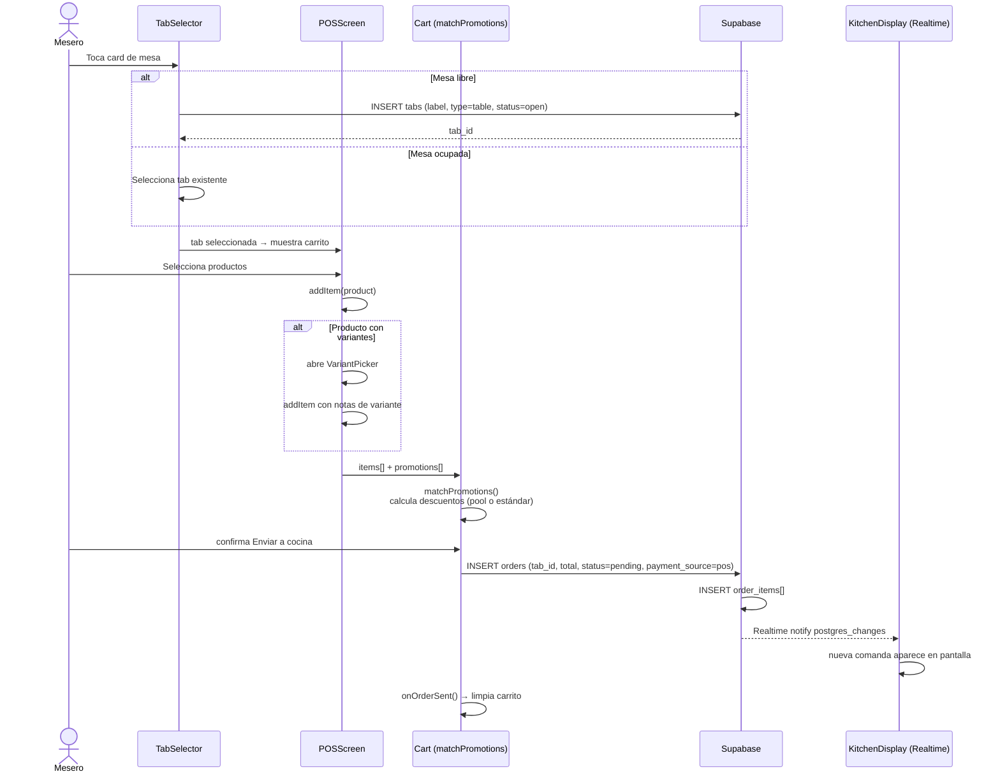
```mermaid
sequenceDiagram
    actor Mesero
    participant TS as TabSelector
    participant POS as POSScreen
    participant CART as Cart (matchPromotions)
    participant DB as Supabase
    participant KD as KitchenDisplay (Realtime)

    Mesero->>TS: Toca card de mesa

    alt Mesa libre
        TS->>DB: INSERT tabs (label, type=table, status=open)
        DB-->>TS: tab_id
    else Mesa ocupada
        TS->>TS: Selecciona tab existente
    end

    TS->>POS: tab seleccionada → muestra carrito

    Mesero->>POS: Selecciona productos
    POS->>POS: addItem(product)

    alt Producto con variantes
        POS->>POS: abre VariantPicker
        POS->>POS: addItem con notas de variante
    end

    POS->>CART: items[] + promotions[]
    CART->>CART: matchPromotions()<br/>calcula descuentos (pool o estándar)

    Mesero->>CART: confirma Enviar a cocina
    CART->>DB: INSERT orders (tab_id, total, status=pending, payment_source=pos)
    DB->>DB: INSERT order_items[]
    DB-->>KD: Realtime notify postgres_changes
    KD->>KD: nueva comanda aparece en pantalla

    CART->>CART: onOrderSent() → limpia carrito
```

### 7.2 Flujo de cobro — TicketPreview

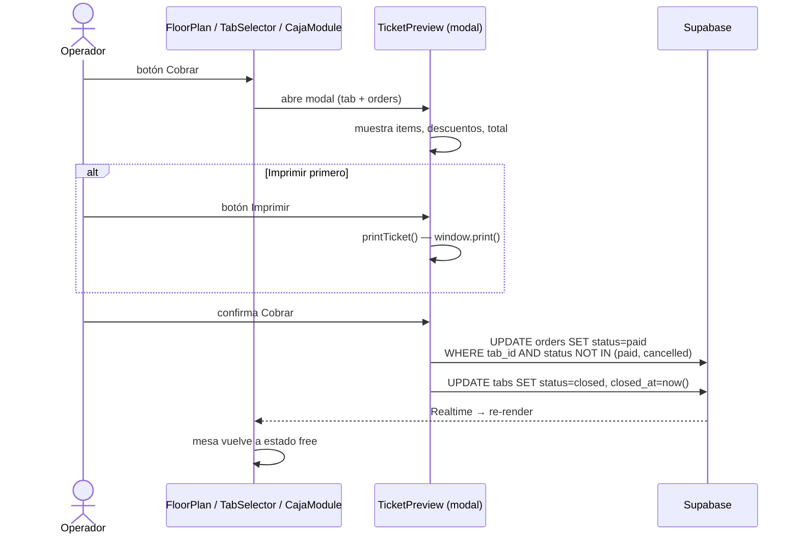
```mermaid
sequenceDiagram
    actor Operador
    participant Parent as FloorPlan / TabSelector / CajaModule
    participant TP as TicketPreview (modal)
    participant DB as Supabase

    Operador->>Parent: botón Cobrar
    Parent->>TP: abre modal (tab + orders)

    TP->>TP: muestra items, descuentos, total

    alt Imprimir primero
        Operador->>TP: botón Imprimir
        TP->>TP: printTicket() — window.print()
    end

    Operador->>TP: confirma Cobrar
    TP->>DB: UPDATE orders SET status=paid<br/>WHERE tab_id AND status NOT IN (paid, cancelled)
    TP->>DB: UPDATE tabs SET status=closed, closed_at=now()

    DB-->>Parent: Realtime → re-render
    Parent->>Parent: mesa vuelve a estado free
```

### 7.3 Flujo de turno de caja

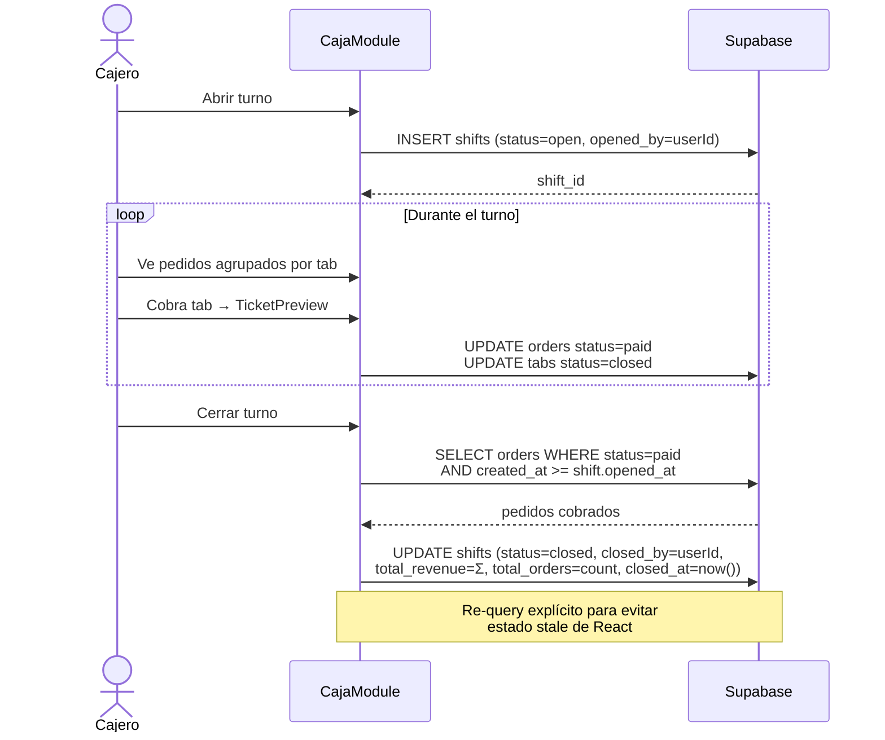
```mermaid
sequenceDiagram
    actor Cajero
    participant CM as CajaModule
    participant DB as Supabase

    Cajero->>CM: Abrir turno
    CM->>DB: INSERT shifts (status=open, opened_by=userId)
    DB-->>CM: shift_id

    loop Durante el turno
        Cajero->>CM: Ve pedidos agrupados por tab
        Cajero->>CM: Cobra tab → TicketPreview
        CM->>DB: UPDATE orders status=paid<br/>UPDATE tabs status=closed
    end

    Cajero->>CM: Cerrar turno
    CM->>DB: SELECT orders WHERE status=paid<br/>AND created_at >= shift.opened_at
    DB-->>CM: pedidos cobrados
    CM->>DB: UPDATE shifts (status=closed, closed_by=userId,<br/>total_revenue=Σ, total_orders=count, closed_at=now())

    Note over CM,DB: Re-query explícito para evitar<br/>estado stale de React
```

### 7.4 Matching de promociones en Cart

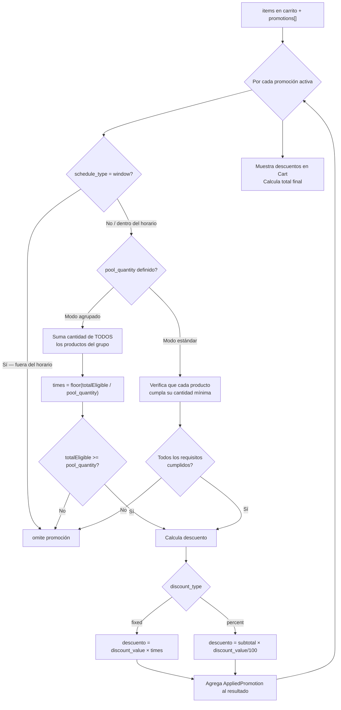
```mermaid
flowchart TD
    A["items en carrito + promotions[]"]
    A --> B{"Por cada promoción activa"}

    B --> C{"schedule_type = window?"}
    C -->|"Sí — fuera del horario"| SKIP["omite promoción"]
    C -->|"No / dentro del horario"| D{"pool_quantity definido?"}

    D -->|"Modo agrupado"| E["Suma cantidad de TODOS<br/>los productos del grupo"]
    E --> F["times = floor(totalEligible / pool_quantity)"]
    F --> G{"totalEligible >= pool_quantity?"}
    G -->|"No"| SKIP

    D -->|"Modo estándar"| H["Verifica que cada producto<br/>cumpla su cantidad mínima"]
    H --> I{"Todos los requisitos<br/>cumplidos?"}
    I -->|"No"| SKIP

    G -->|"Sí"| CALC
    I -->|"Sí"| CALC["Calcula descuento"]
    CALC --> J{"discount_type"}
    J -->|"fixed"| K["descuento = discount_value × times"]
    J -->|"percent"| L["descuento = subtotal × discount_value/100"]
    K & L --> M["Agrega AppliedPromotion al resultado"]
    M --> B

    B --> N["Muestra descuentos en Cart<br/>Calcula total final"]
```

---

## 8. PWA e infraestructura web

### 8.1 Arquitectura PWA

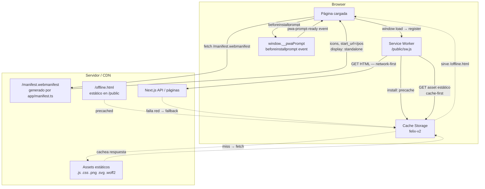
```mermaid
graph TD
    subgraph Browser["Browser"]
        PAGE["Página cargada"]
        SW["Service Worker<br/>/public/sw.js"]
        CACHE["Cache Storage<br/>felix-v2"]
        PROMPT["window.__pwaPrompt<br/>beforeinstallprompt event"]
    end

    subgraph Server["Servidor / CDN"]
        MANIFEST["/manifest.webmanifest<br/>generado por app/manifest.ts"]
        OFFLINE["/offline.html<br/>estático en /public"]
        ASSETS["Assets estáticos<br/>.js .css .png .svg .woff2"]
        API["Next.js API / páginas"]
    end

    PAGE -->|"window load → register"| SW
    SW -->|"install: precache"| CACHE
    OFFLINE -.->|"precached"| CACHE

    PAGE -->|"fetch /manifest.webmanifest"| MANIFEST
    MANIFEST -->|"icons, start_url=/pos<br/>display: standalone"| PAGE

    PAGE -->|"beforeinstallprompt"| PROMPT
    PROMPT -->|"pwa-prompt-ready event"| PAGE

    SW -->|"GET asset estático<br/>cache-first"| CACHE
    CACHE -.->|"miss → fetch"| ASSETS
    ASSETS -.->|"cachea respuesta"| CACHE

    SW -->|"GET HTML — network-first"| API
    API -.->|"falla red → fallback"| CACHE
    CACHE -.->|"sirve /offline.html"| PAGE
```

### 8.2 Manifest PWA — campos clave

| Campo | Valor |
|---|---|
| `name` | `Gorditas Doña Félix` |
| `short_name` | `Doña Félix` |
| `id` | `/` |
| `start_url` | `/pos` |
| `scope` | `/` |
| `display` | `standalone` |
| `background_color` | `#fafaf9` |
| `theme_color` | `#b45309` (amber-700) |
| `orientation` | `portrait` |
| `icons` | `icon-192.png` + `icon-512.png` (purpose: `any` + `maskable`) |
| `categories` | `food`, `productivity` |

### 8.3 Estrategia de caché del Service Worker

| Tipo de request | Estrategia | Caché |
|---|---|---|
| Assets estáticos `.png` `.js` `.css` `.svg` `.ico` `.woff2` | **Cache-first** → fetch si miss → cachea | `felix-v2` |
| Páginas HTML / rutas Next.js | **Network-first** → fallback `/offline.html` | — |
| Supabase / APIs externas (distinto hostname) | **Pass-through** — siempre red | — |
| `/offline.html` | **Precached** en install | `felix-v2` |
| Métodos no-GET (`POST`, `PATCH`, etc.) | **Pass-through** | — |

---

## Resumen de stack tecnológico

| Capa | Tecnología | Notas |
|------|-----------|-------|
| Framework | Next.js 16 App Router | RSC + API Routes |
| Runtime | Node.js en Vercel serverless | Timeout ~10s free tier |
| BaaS | Supabase | Postgres + Auth + Realtime + Storage |
| Estilos | Tailwind CSS v4 | CSS vars `brand-*`, tema dinámico desde DB |
| Iconos | Lucide React | Único proveedor — sin mezclado de librerías |
| Estado server | Server Components + fetch | Datos iniciales sin client state |
| Estado client | React `useState` + Realtime | Sin Redux / Zustand |
| Caché queries | TanStack Query | Via `QueryProvider` en root layout |
| Agente IA | Multi-proveedor | Claude / Gemini / Ollama |
| PWA | Service Worker manual | Cache `felix-v2`, offline fallback |
| Auth | Supabase Auth (JWT) | Cookies SSR via `@supabase/ssr` |
| Acceso a DB | PostgREST (Supabase client) | anon (RLS) + service-role (bypass) |
| Tipos | TypeScript strict | `src/lib/types/index.ts` como fuente de verdad |
